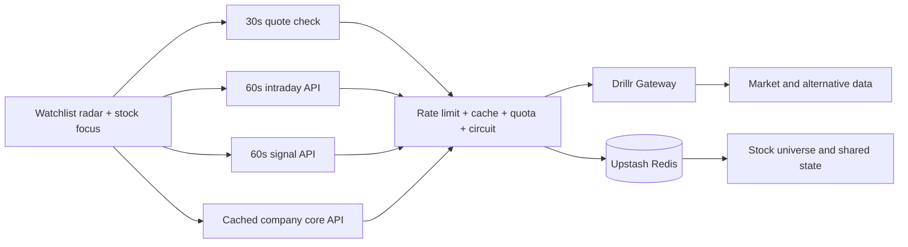

<div align="center">
  
  <h1>drillr Market Command</h1>
  <p><strong>A no-scroll, high-density market cockpit powered by real Drillr data.</strong></p>

  <p>
    <a href="https://github.com/huluwa2026/drillr-market-dashboard/actions/workflows/ci.yml"></a>
    <a href="https://github.com/huluwa2026/drillr-market-dashboard/actions/workflows/codeql.yml"></a>
    <a href="https://drillr-market-dashboard.vercel.app/?lang=en"></a>
    <a href="./LICENSE"></a>
    
    
  </p>

  <p>
    <a href="https://drillr-market-dashboard.vercel.app/?lang=en"><strong>Live demo</strong></a>
    · <a href="./README.zh-CN.md">简体中文</a>
    · <a href="./CONTRIBUTING.md">Contribute</a>
    · <a href="https://github.com/huluwa2026/drillr-market-dashboard/discussions">Discussions</a>
  </p>
</div>

[](https://drillr-market-dashboard.vercel.app/?lang=en)

## Why this project

Most stock dashboards either show too little at once or force users through a
long page of disconnected numbers. drillr Market Command is designed around one
desktop decision loop: **scan the watchlist, identify what changed, and inspect
one stock without leaving the screen**.

Production code uses real data from the [Drillr](https://drillr.ai) financial
data gateway. It never replaces unavailable market data with invented values.

| At a glance | |
| --- | --- |
| Views | Change-ranked watchlist radar and single-stock focus |
| Market view | Interactive 5-minute candlesticks, volume, extended hours, catalysts, and peers |
| Intelligence | 7 chart-led panels and 200+ visible data marks in focus mode |
| Refresh | Quotes checked every 30s; intraday bars and signals every 60s |
| Layout | Fixed single-screen desktop cockpit; responsive tablet/mobile flow |
| Languages | English and Simplified Chinese |
| Runtime | Next.js 16, React 19, Vercel, and Upstash Redis |

## Contents

- [Features](#features)
- [Architecture](#architecture)
- [Quick start](#quick-start)
- [Configuration](#configuration)
- [Quality and testing](#quality-and-testing)
- [Deploying safely](#deploying-safely)
- [Contributing and support](#contributing-and-support)
- [Data and license](#data-and-license)

## Features

- **Real data only.** There is no mock market-data fallback in production.
- **Focused watchlist.** Track one to six stocks; NVDA, GOOGL, TSLA, and AAPL
  are the defaults.
- **Change-ranked radar.** Compare prices, multi-period returns, valuation,
  momentum, extended-hours moves, events, and target upside at a glance.
- **Interactive price action.** The latest one-minute session is aggregated
  into five-minute candles with a crosshair, OHLC, volume, and scrubber.
- **Visual fundamentals.** Valuation, economic quality, growth, returns, trend,
  expectations, and balance-sheet/payout signals are chart-led rather than raw
  number grids.
- **Honest freshness.** Refresh timing and upstream source cadence are visible
  in the interface.
- **Built-in internationalization.** Browser language is detected, preference
  is remembered locally, and `?lang=en` / `?lang=zh` provides an explicit URL.
- **Public-demo guardrails.** Vercel WAF and Redis-backed rate limits, caches,
  refresh locks, daily budgets, and circuit breaking protect the upstream key.

## Architecture



The Drillr API key stays server-side. Browsers only call guarded Next.js API
routes. Local development uses an in-memory store; production requires Redis so
rate limits and quota accounting cannot silently become instance-local.

## Quick start

### Requirements

- Node.js 22.13 or later
- npm
- A Drillr Gateway API key

```bash
git clone https://github.com/huluwa2026/drillr-market-dashboard.git
cd drillr-market-dashboard
cp .env.example .env.local
npm install
npm run dev
```

Set `DRILLR_API_KEY` in `.env.local`, then open
[localhost:3000/?lang=en](http://localhost:3000/?lang=en). Use
[`?lang=zh`](http://localhost:3000/?lang=zh) for Chinese.

Local development needs no database. Set `ALLOW_LOCAL_ADMIN=true` to enable the
stock-management drawer locally; this switch is ignored in production.

## Configuration

The complete, copyable list is in [`.env.example`](./.env.example).

| Variable | Required | Purpose |
| --- | --- | --- |
| `DRILLR_API_KEY` | Yes | Server-side Drillr Gateway credential |
| `DRILLR_GATEWAY_URL` | No | Gateway endpoint; defaults to `https://gateway.drillr.ai` |
| `UPSTASH_REDIS_REST_URL` / `KV_REST_API_URL` | Production | Upstash Redis REST endpoint |
| `UPSTASH_REDIS_REST_TOKEN` / `KV_REST_API_TOKEN` | Production | Upstash Redis REST token |
| `REDIS_KEY_PREFIX` | No | Redis namespace |
| `PUBLIC_API_*_RATE_LIMIT_PER_MINUTE` | No | Global and route-specific client limits |
| `DRILLR_DAILY_*_LIMIT` | No | Global and route-specific upstream daily budgets |
| `DRILLR_CIRCUIT_*` | No | Failure threshold and recovery cooldown |
| `RATE_LIMIT_SALT` | Production | Secret used to hash client addresses stored in Redis |
| `TRUSTED_IDENTITY_MODE` | No | `disabled`, `hmac`, or explicitly trusted `openai-sites` |
| `ADMIN_EMAILS` | For production writes | Admin allowlist; empty disables writes |
| `ALLOW_LOCAL_ADMIN` | Local only | Enables local stock-universe management |

Never expose `DRILLR_API_KEY` through a public environment prefix or commit an
`.env.local` file.

## Quality and testing

```bash
npm run lint       # ESLint
npm run typecheck  # TypeScript without emitting files
npm test           # fast repository tests
npm run build      # production Next.js build
npm run test:e2e   # Playwright behavior + visual regression
npm run check      # lint + typecheck + test + build
```

Install Chromium once with `npx playwright install chromium` before the E2E
suite. Playwright uses deterministic network fixtures in tests; they are never
bundled into production.

Every push and pull request runs separate **Quality**, **Production build**, and
**Browser and visual tests** jobs. Failed browser runs retain a Playwright report
for seven days. CodeQL scans JavaScript and TypeScript on pushes, pull requests,
and a weekly schedule. Dependabot checks npm packages weekly and GitHub Actions
monthly.

## Deploying safely

The public demo is deployed on Vercel with Upstash Redis. A public fork uses the
deployment owner's Drillr quota, so do not deploy with only an API key:

1. connect Upstash Redis;
2. configure global and route-level budgets;
3. add a Vercel Firewall limit for `/api/*`;
4. leave production writes disabled unless trusted identity is configured;
5. verify your Drillr plan permits the intended public display.

See [DEPLOYMENT.md](./DEPLOYMENT.md) for the trust boundaries, WAF rule, identity
modes, and pre-launch checklist.

## Contributing and support

Contributions are welcome. Start with
[`good first issue`](https://github.com/huluwa2026/drillr-market-dashboard/labels/good%20first%20issue)
or read [CONTRIBUTING.md](./CONTRIBUTING.md) before opening a pull request.

- Usage and setup questions: [GitHub Discussions](https://github.com/huluwa2026/drillr-market-dashboard/discussions)
- Bugs and feature requests: [GitHub Issues](https://github.com/huluwa2026/drillr-market-dashboard/issues)
- Security reports: [private reporting instructions](./SECURITY.md)
- Community expectations: [Code of Conduct](./CODE_OF_CONDUCT.md)

More support routes are listed in [SUPPORT.md](./SUPPORT.md).

## Data and license

This project is software, not investment advice. Drillr market data is not
included in the repository and remains governed by the user's Drillr account
and API plan. The MIT license covers the source code, not third-party market
data or trademark rights; see [NOTICE.md](./NOTICE.md).

Released under the [MIT License](./LICENSE).
