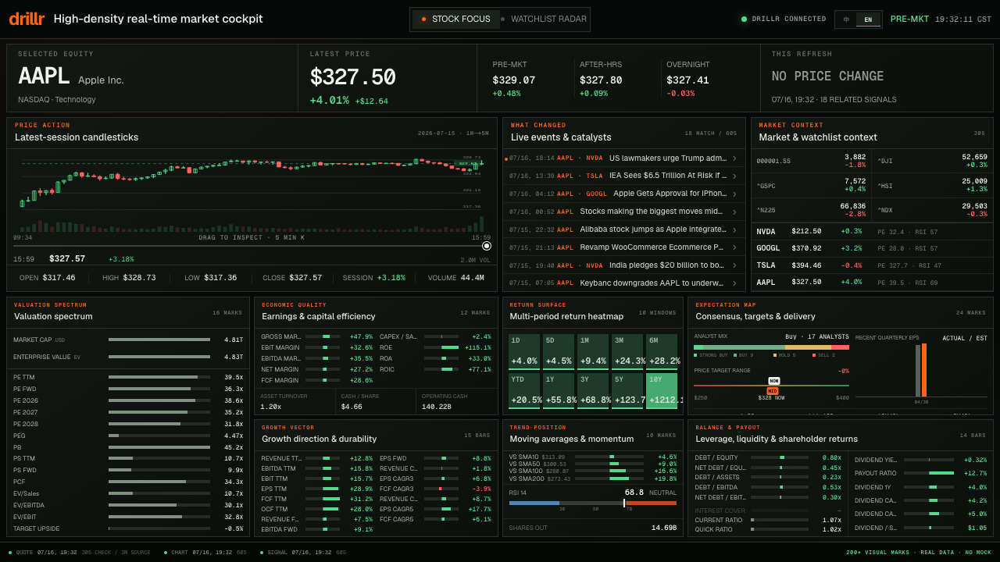
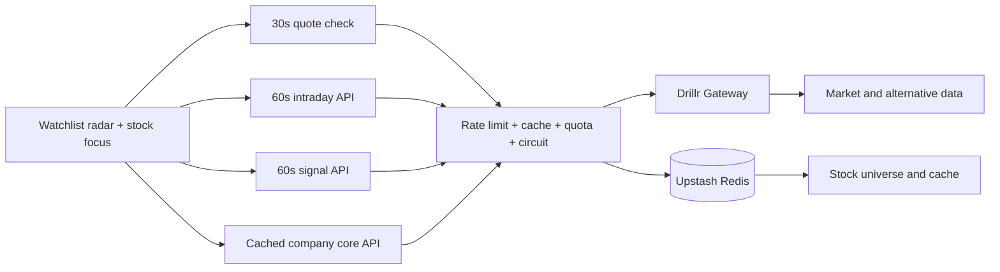

# drillr Market Command

[Live demo](https://drillr-market-dashboard.vercel.app/?lang=en) · [简体中文](./README.zh-CN.md)

A no-scroll, high-density market cockpit powered by the
[Drillr](https://drillr.ai) financial data gateway.



The desktop workflow has two levels: scan the watchlist radar for meaningful
changes, then open a single-stock focus view with interactive five-minute
candles, extended-hours moves, catalysts, peer context, and seven visual
intelligence panels. Tablet and mobile layouts reflow into a scrollable view.
Production code never substitutes invented market data.

## Highlights

- Real Drillr Gateway data only—no mock market-data fallback in production.
- A configurable watchlist of one to six stocks, with NVDA, GOOGL, TSLA, and AAPL as defaults.
- A change-ranked radar with prices, multi-period returns, valuation, momentum, extended-hours moves, events, and target upside.
- Interactive five-minute candlesticks aggregated from the latest one-minute session, including pointer crosshair, OHLC, volume, and a scrubber.
- Seven chart-led panels for valuation, economic quality, growth, returns, trend, expectations, and balance-sheet/payout signals.
- More than 200 visible data marks in focus mode, plus radar coverage for Drillr's structured fields and alternative-data catalog.
- Quotes checked every 30 seconds and intraday bars/signals refreshed every 60 seconds, with the source cadence shown honestly in the UI.
- Vercel WAF plus Upstash Redis-backed global/route rate limits, distributed refresh locks, daily gateway budgets, and circuit breaking in production.
- Fixed single-screen desktop layout with responsive tablet and mobile flows.
- Built-in English and Simplified Chinese UI, selected by browser preference,
  remembered locally, or set explicitly with `?lang=en` / `?lang=zh`.

## Architecture



The Drillr API key remains server-side. Browser code only talks to this
application's guarded API routes.

## Requirements

- Node.js 22.13 or later
- npm
- A Drillr Gateway API key

## Quick start

```bash
git clone https://github.com/huluwa2026/drillr-market-dashboard.git
cd drillr-market-dashboard
cp .env.example .env.local
npm install
npm run dev
```

Set `DRILLR_API_KEY` in `.env.local`, then open
[http://localhost:3000/?lang=en](http://localhost:3000/?lang=en). Use
[`?lang=zh`](http://localhost:3000/?lang=zh) for Simplified Chinese; the header
switch changes and remembers the preference without reloading the dashboard.

Local development uses an in-memory store, so no database setup is required.
With `ALLOW_LOCAL_ADMIN=true`, the stock-management drawer is writable during
local development. This switch is ignored in production. Production deployments
must configure Upstash Redis.

## Environment variables

| Variable | Required | Description |
| --- | --- | --- |
| `DRILLR_API_KEY` | Yes | Server-side Drillr Gateway credential. |
| `DRILLR_GATEWAY_URL` | No | Gateway endpoint; defaults to `https://gateway.drillr.ai`. |
| `UPSTASH_REDIS_REST_URL` | Production | Upstash Redis REST endpoint, normally injected by the Vercel Marketplace integration. |
| `UPSTASH_REDIS_REST_TOKEN` | Production | Server-side Upstash Redis REST token. |
| `KV_REST_API_URL` | Alternative | Compatible Vercel Marketplace alias for the Upstash REST endpoint. |
| `KV_REST_API_TOKEN` | Alternative | Compatible Vercel Marketplace alias for the Upstash REST token. |
| `REDIS_KEY_PREFIX` | No | Redis namespace; defaults to `drillr-market-dashboard:v1`. |
| `PUBLIC_API_RATE_LIMIT_PER_MINUTE` | No | Global per-client API limit across all read routes; defaults to `20`. |
| `PUBLIC_API_*_RATE_LIMIT_PER_MINUTE` | No | Route limits for `DASHBOARD`, `LIVE`, `SIGNALS`, `INTRADAY`, and `STOCKS`; defaults to `3`, `6`, `4`, `10`, and `6`. |
| `DRILLR_DAILY_REQUEST_LIMIT` | No | Global upstream Gateway calls per UTC day; defaults to `5000`. |
| `DRILLR_DAILY_*_LIMIT` | No | Upstream sub-budgets for `DASHBOARD`, `LIVE`, `SIGNALS`, and `INTRADAY`. |
| `DRILLR_CIRCUIT_FAILURE_THRESHOLD` | No | Consecutive failures before opening the circuit; defaults to `5`. |
| `DRILLR_CIRCUIT_COOLDOWN_SECONDS` | No | Open-circuit cooldown; defaults to `60`. |
| `RATE_LIMIT_SALT` | Production | Random secret used to hash client addresses stored in Redis. |
| `TRUSTED_IDENTITY_MODE` | No | `disabled` (default), `hmac`, or explicitly trusted `openai-sites`. |
| `TRUSTED_IDENTITY_HMAC_SECRET` | For `hmac` | At least 32 characters; shared only with the trusted identity proxy. |
| `ADMIN_EMAILS` | For production writes | Comma-separated production admin allowlist. Empty disables writes. |
| `ALLOW_LOCAL_ADMIN` | No | Enables local-only stock management when set to `true`. |

Never expose `DRILLR_API_KEY` through a public environment prefix or commit it
to source control.

## Commands

```bash
npm run dev      # start the local development server
npm run lint     # run ESLint
npm test         # build and run the repository tests
npm run test:e2e # run Playwright interaction and visual-regression tests
npm run build    # create a production build
```

Install the local browser once with `npx playwright install chromium` before
running the end-to-end suite.

## Public deployment safety

- Live quotes, intraday bars, and signals use 60-second shared Redis caches;
  the low-frequency core retains its longer cache.
- Public routes consume a global per-client rate bucket plus a stricter
  route-specific bucket before touching Drillr.
- A Redis refresh lock prevents multiple Vercel instances from refilling the
  same expired cache concurrently.
- Every upstream request atomically consumes both a global UTC-day budget and a
  route-specific sub-budget. Five consecutive failures open a default
  60-second circuit.
- Expired cached data may be served briefly while Drillr is unavailable.
- Upstream error details are logged server-side and never returned to browsers.
- Production admin writes are disabled unless `ADMIN_EMAILS` is non-empty and
  the identity mode is explicitly configured. A matching Vercel Firewall rule
  is required before public launch; see [DEPLOYMENT.md](./DEPLOYMENT.md).

## Data, brand, and test fixtures

Drillr market data is not included in this repository and is governed by the
terms of the user's Drillr account and API plan. The MIT license covers the
software, not third-party market data or trademark rights. See
[NOTICE.md](./NOTICE.md).

Playwright uses deterministic network fixtures for layout regression in CI.
Those fixtures are test-only and are never bundled into a production path.

## Contributing

See [CONTRIBUTING.md](./CONTRIBUTING.md). Please report security issues through
the private process described in [SECURITY.md](./SECURITY.md).

## License

[MIT](./LICENSE)
