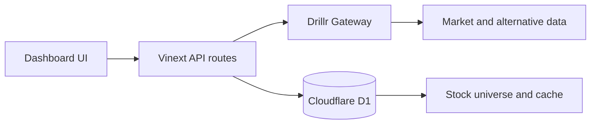

# drillr Market Dashboard

[简体中文](./README.zh-CN.md)

A dense, one-screen US equity dashboard powered by real data from the
[Drillr](https://drillr.ai) financial data gateway.


The project is designed to demonstrate the breadth of a financial data platform
without hiding information behind tabs or filling the interface with mock data.
Desktop uses a fixed single-screen layout; tablet and mobile layouts reflow into
a scrollable view.

## Highlights

- Real Drillr Gateway data only—no mock market-data fallback.
- A configurable stock universe with NVDA, GOOGL, TSLA, and AAPL as defaults.
- Structured fundamentals, price history, analyst consensus, earnings,
  ownership activity, extended-hours quotes, and market indices.
- Alternative-data catalog coverage across energy, compute, semiconductors,
  macro, prediction markets, and other AI infrastructure layers.
- More than ten visualization forms, including candlesticks, heatmaps, radial
  bars, radar comparison, signal bubbles, valuation bars, consensus stacks,
  lollipops, paired columns, target whiskers, and ownership bubbles.
- Cloudflare D1-backed stock configuration and response caching.
- Responsive desktop, tablet, and mobile layouts.

## Architecture



The Drillr API key remains server-side. Browser code only talks to this
application's API routes.

## Requirements

- Node.js 22.13 or later
- npm
- A Drillr Gateway API key

## Quick start

```bash
git clone https://github.com/huluwa2026/drillr-market-dashboard.git
cd drillr-market-dashboard
cp .env.example .env.local
npm install
npm run dev
```

Set `DRILLR_API_KEY` in `.env.local`, then open
[http://localhost:3000](http://localhost:3000).

The local Cloudflare runtime creates the D1 tables automatically. With
`ALLOW_LOCAL_ADMIN=true`, the stock-management drawer is writable during local
development. This switch is ignored in production.

## Environment variables

| Variable | Required | Description |
| --- | --- | --- |
| `DRILLR_API_KEY` | Yes | Server-side Drillr Gateway credential. |
| `DRILLR_GATEWAY_URL` | No | Gateway endpoint; defaults to `https://gateway.drillr.ai`. |
| `ADMIN_EMAILS` | No | Comma-separated production admin allowlist. |
| `ALLOW_LOCAL_ADMIN` | No | Enables local-only stock management when set to `true`. |

Never expose `DRILLR_API_KEY` through a public environment prefix or commit it
to source control.

## Commands

```bash
npm run dev      # start the local development server
npm run lint     # run ESLint
npm test         # build and run the repository tests
npm run build    # create a production build
```

## Data and authentication notes

- The dashboard intentionally fails visibly when real data is unavailable; it
  does not silently switch to invented values.
- Production stock management expects trusted identity headers, such as those
  supplied by OpenAI Sites, and can be restricted with `ADMIN_EMAILS`.
- The local admin bypass is limited to non-production builds.
- Drillr data access is subject to the terms associated with your Drillr
  account and API plan.

## Contributing

See [CONTRIBUTING.md](./CONTRIBUTING.md). Please report security issues through
the private process described in [SECURITY.md](./SECURITY.md).

## License

[MIT](./LICENSE)
