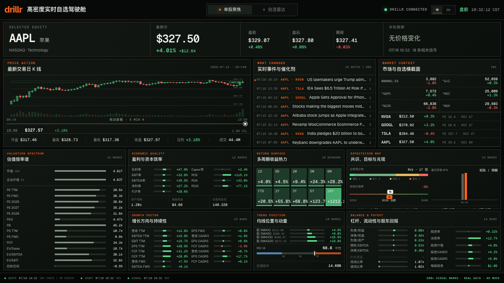
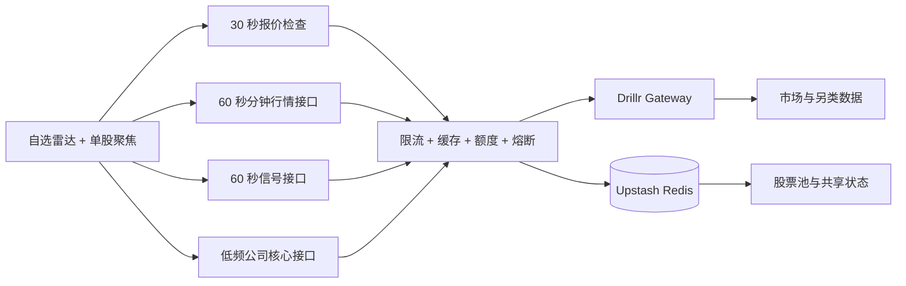

<div align="center">
  
  <h1>drillr Market Command</h1>
  <p><strong>由 Drillr 真实数据驱动、不滚动的高密度实时市场驾驶舱。</strong></p>

  <p>
    <a href="https://github.com/huluwa2026/drillr-market-dashboard/actions/workflows/ci.yml"></a>
    <a href="https://github.com/huluwa2026/drillr-market-dashboard/actions/workflows/codeql.yml"></a>
    <a href="https://drillr-market-dashboard.vercel.app/?lang=zh"></a>
    <a href="./LICENSE"></a>
    
    
  </p>

  <p>
    <a href="https://drillr-market-dashboard.vercel.app/?lang=zh"><strong>在线体验</strong></a>
    · <a href="./README.md">English</a>
    · <a href="./CONTRIBUTING.md">参与贡献</a>
    · <a href="https://github.com/huluwa2026/drillr-market-dashboard/discussions">交流讨论</a>
    · <a href="https://drillr.ai/l/market-command-gh">使用 Drillr 构建</a>
  </p>
</div>

[](https://drillr-market-dashboard.vercel.app/?lang=zh)

## 为什么做这个项目

很多股票大盘要么单屏信息太少，要么把互不相干的数字堆成一个很长的页面。
drillr Market Command 围绕一个明确的桌面决策流程设计：**先扫描自选股、发现什么
正在变化，再在不离开单屏的情况下聚焦一只股票。**

生产代码只使用
[Drillr 金融数据网关](https://drillr.ai/l/market-command-gh)提供的真实数据。真实行情不可用
时，页面不会偷偷切换成虚构数据。

| 快速了解 | |
| --- | --- |
| 两种视图 | 按变化排序的自选雷达 + 单股聚焦 |
| 行情画面 | 可交互五分钟 K 线、成交量、盘前盘后、催化剂和同业对比 |
| 情报密度 | 单股页 7 个图表面板、200+ 个可见数据标记 |
| 刷新频率 | 报价每 30 秒检查，分钟行情和信号每 60 秒刷新 |
| 页面布局 | 桌面端严格单屏，平板和手机端自适应流式布局 |
| 国际化 | 英文与简体中文 |
| 技术栈 | Next.js 16、React 19、Vercel、Upstash Redis |

## 目录

- [核心能力](#核心能力)
- [系统架构](#系统架构)
- [本地启动](#本地启动)
- [配置说明](#配置说明)
- [质量与测试](#质量与测试)
- [安全部署](#安全部署)
- [参与贡献与获取帮助](#参与贡献与获取帮助)
- [数据与许可证](#数据与许可证)

## 核心能力

- **只用真实数据：**生产环境没有模拟行情兜底。
- **聚焦型自选池：**支持关注 1～6 只股票，默认包含英伟达、谷歌、特斯拉和苹果。
- **变化优先的雷达：**一眼对比价格、多周期收益、估值、动量、盘前盘后、事件数量和目标价空间。
- **可交互行情：**把最新交易日一分钟行情聚合成五分钟 K 线，支持十字光标、OHLC、成交量和拖动条。
- **图表化基本面：**用图表而不是纯数字方格呈现估值、盈利质量、成长、收益、趋势、预期、杠杆和股东回报。
- **诚实的数据新鲜度：**界面直接显示刷新时间和底层数据实际频率。
- **内置国际化：**自动识别浏览器语言、在本地记住选择，也支持 `?lang=en` / `?lang=zh` 固定语言链接。
- **公开服务防护：**Vercel WAF 配合 Redis 限流、共享缓存、刷新锁、每日预算和连续失败熔断，保护上游 API Key。

## 系统架构



Drillr API Key 始终留在服务端，浏览器只访问经过防护的 Next.js API。开发环境使用
内存存储；生产环境强制要求 Redis，避免限流和额度统计退化成单实例状态。

## 本地启动

### 环境要求

- Node.js 22.13 或更高版本
- npm
- Drillr Gateway API Key

```bash
git clone https://github.com/huluwa2026/drillr-market-dashboard.git
cd drillr-market-dashboard
cp .env.example .env.local
npm install
npm run dev
```

在 `.env.local` 中填写 `DRILLR_API_KEY`，然后访问
[localhost:3000/?lang=zh](http://localhost:3000/?lang=zh)。英文界面使用
[`?lang=en`](http://localhost:3000/?lang=en)。

先[创建 Drillr API Key](https://drillr.ai/l/market-command-gh)。服务端网关请求会携带 `X-Drillr-Via: drillr-market-dashboard` 项目标识，用于汇总项目用量，不会给公开页面 URL 添加追踪参数。

本地开发不需要数据库。设置 `ALLOW_LOCAL_ADMIN=true` 可以启用股票池管理抽屉；
生产环境会忽略这个开关。

## 配置说明

完整且可直接复制的变量列表见 [`.env.example`](./.env.example)。

| 变量 | 必填 | 用途 |
| --- | --- | --- |
| `DRILLR_API_KEY` | 是 | 仅在服务端使用的 Drillr Gateway 凭证 |
| `DRILLR_GATEWAY_URL` | 否 | 网关地址，默认 `https://gateway.drillr.ai` |
| `UPSTASH_REDIS_REST_URL` / `KV_REST_API_URL` | 生产环境 | Upstash Redis REST 地址 |
| `UPSTASH_REDIS_REST_TOKEN` / `KV_REST_API_TOKEN` | 生产环境 | Upstash Redis REST Token |
| `REDIS_KEY_PREFIX` | 否 | Redis 命名空间 |
| `PUBLIC_API_*_RATE_LIMIT_PER_MINUTE` | 否 | 全局及各接口的来源限流 |
| `DRILLR_DAILY_*_LIMIT` | 否 | 全局及各接口的每日上游预算 |
| `DRILLR_CIRCUIT_*` | 否 | 连续失败阈值与恢复冷却时间 |
| `RATE_LIMIT_SALT` | 生产环境 | 散列 Redis 中访问来源的密钥 |
| `TRUSTED_IDENTITY_MODE` | 否 | `disabled`、`hmac` 或明确可信的 `openai-sites` |
| `ADMIN_EMAILS` | 生产写操作 | 管理员白名单；留空即禁用写操作 |
| `ALLOW_LOCAL_ADMIN` | 仅本地 | 开启本地股票池管理 |

严禁把 `DRILLR_API_KEY` 放进公开前缀环境变量，也不要提交 `.env.local`。

## 质量与测试

```bash
npm run lint       # ESLint
npm run typecheck  # TypeScript 类型检查，不生成文件
npm test           # 快速仓库测试
npm run build      # Next.js 生产构建
npm run test:e2e   # Playwright 交互与视觉回归
npm run check      # lint + typecheck + test + build
```

首次执行 E2E 前运行 `npx playwright install chromium`。Playwright 使用确定性的网络
夹具；它们只存在于测试路径，不会被打包到生产环境。

每次 push 和 Pull Request 会分别执行 **代码质量**、**生产构建**、**浏览器与视觉测试**
三个任务。浏览器任务失败时会保留 7 天 Playwright 报告。CodeQL 会在 push、PR 和
每周定时任务中扫描 JavaScript/TypeScript；Dependabot 每周检查 npm、每月检查
GitHub Actions。

## 安全部署

在线体验部署在 Vercel，并使用 Upstash Redis。公开 Fork 会消耗部署者自己的
Drillr 额度，因此不能只填一个 API Key 就直接上线：

1. 接入 Upstash Redis；
2. 配置全局和各接口的每日预算；
3. 为 `/api/*` 增加 Vercel Firewall 限流；
4. 在可信身份接入前保持生产写操作关闭；
5. 确认 Drillr 套餐允许预期的公开展示方式。

完整信任边界、WAF 规则、身份模式和上线检查清单见 [DEPLOYMENT.md](./DEPLOYMENT.md)。

## 隐私

在线体验使用 Vercel Web Analytics 统计匿名、汇总的页面访问和来源，不设置分析 Cookie，也不发送自定义交互事件。事件发送前会移除查询参数和 URL 片段，因此语言、股票和所选视图不会进入分析数据。跳转 Drillr 使用可读的品牌短链，落地后的地址栏不显示 UTM 参数。

## 参与贡献与获取帮助

欢迎参与贡献。可以先查看
[`good first issue`](https://github.com/huluwa2026/drillr-market-dashboard/labels/good%20first%20issue)，
提交 Pull Request 前请阅读 [CONTRIBUTING.md](./CONTRIBUTING.md)。

- 使用与部署问题：[GitHub Discussions](https://github.com/huluwa2026/drillr-market-dashboard/discussions)
- Bug 和功能建议：[GitHub Issues](https://github.com/huluwa2026/drillr-market-dashboard/issues)
- 安全漏洞：[私密报告说明](./SECURITY.md)
- 社区行为约定：[Code of Conduct](./CODE_OF_CONDUCT.md)

更多帮助渠道见 [SUPPORT.md](./SUPPORT.md)。

## 数据与许可证

本项目是软件，不构成投资建议。仓库不包含 Drillr 金融数据；数据访问和展示仍受
用户自己的 Drillr 账户与 API 套餐约束。MIT 许可证只覆盖源代码，不自动授予
第三方市场数据或商标权利，详见 [NOTICE.md](./NOTICE.md)。

项目采用 [MIT License](./LICENSE) 开源。
