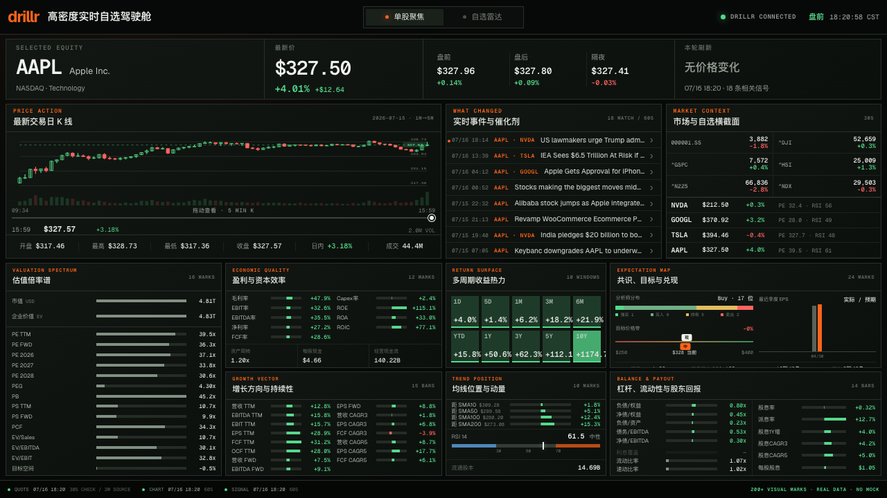

# drillr Market Command

[English](./README.md)

一个由 [Drillr](https://drillr.ai) 真实金融数据驱动、不滚动的高密度实时自选股驾驶舱。



桌面端以严格单屏呈现两层工作流：先用“自选雷达”发现哪只股票正在变化，再进入
“单股聚焦”查看可交互五分钟 K 线、盘前盘后、实时催化剂、同业横截面和七个
图表化情报面板。平板和手机端会重排为可滚动页面。生产代码不会在真实数据
不可用时切换到模拟行情。

## 核心能力

- 只读取 Drillr Gateway 真实数据，不提供模拟数据兜底。
- 默认关注英伟达、谷歌、特斯拉和苹果，并支持管理 1～6 只自选股。
- “自选雷达”按变化幅度排序，同时显示价格、多周期收益、估值、动量、盘前盘后、事件数量和目标价空间。
- 将最新交易日一分钟行情聚合为可交互五分钟 K 线，支持鼠标准星、OHLC、成交量和时间拖动条。
- “单股聚焦”使用七个图表化面板呈现估值、盈利质量、成长、收益、趋势、预期、杠杆与股东回报。
- 单股页提供 200+ 个可见数据标记；雷达页继续体现 Drillr 结构化字段和另类数据目录覆盖。
- 报价每 30 秒检查、分时与信号每 60 秒刷新；页面明确标注底层数据实际频率。
- 使用 Cloudflare D1 保存股票池，并提供共享缓存、匿名限流、每日上游额度与连续失败熔断。
- 桌面端不滚动；平板和手机端使用自适应流式布局。

## 环境要求

- Node.js 22.13 或更高版本
- npm
- Drillr Gateway API Key

## 本地启动

```bash
git clone https://github.com/huluwa2026/drillr-market-dashboard.git
cd drillr-market-dashboard
cp .env.example .env.local
npm install
npm run dev
```

在 `.env.local` 中填写 `DRILLR_API_KEY`，然后访问
[http://localhost:3000](http://localhost:3000)。

本地 Cloudflare 运行环境会自动创建所需 D1 数据表。开发环境设置
`ALLOW_LOCAL_ADMIN=true` 后，可以直接使用右上角管理功能；生产环境会忽略该
本地旁路。

## 环境变量

| 变量 | 必填 | 说明 |
| --- | --- | --- |
| `DRILLR_API_KEY` | 是 | 仅在服务端使用的 Drillr Gateway 凭证。 |
| `DRILLR_GATEWAY_URL` | 否 | 网关地址，默认 `https://gateway.drillr.ai`。 |
| `PUBLIC_API_RATE_LIMIT_PER_MINUTE` | 否 | 每个来源每分钟的公开 API 请求上限。 |
| `DRILLR_DAILY_REQUEST_LIMIT` | 否 | 每个 UTC 日最多调用 Drillr Gateway 的次数，默认 `10000`。 |
| `DRILLR_CIRCUIT_FAILURE_THRESHOLD` | 否 | 连续失败多少次后熔断，默认 `5`。 |
| `DRILLR_CIRCUIT_COOLDOWN_SECONDS` | 否 | 熔断冷却时间，默认 `60` 秒。 |
| `RATE_LIMIT_SALT` | 生产环境 | 用于单向散列访问来源的随机密钥。 |
| `TRUSTED_IDENTITY_MODE` | 否 | `disabled`（默认）、`hmac` 或显式可信的 `openai-sites`。 |
| `TRUSTED_IDENTITY_HMAC_SECRET` | HMAC 模式 | 至少 32 个字符，仅与可信身份代理共享。 |
| `ADMIN_EMAILS` | 生产写操作 | 管理员邮箱白名单；留空会禁用生产写操作。 |
| `ALLOW_LOCAL_ADMIN` | 否 | 设置为 `true` 时允许开发环境管理股票池。 |

严禁将 `DRILLR_API_KEY` 写入公开前缀环境变量或提交到 Git。

## 常用命令

```bash
npm run dev      # 启动本地开发服务
npm run lint     # 执行代码检查
npm test         # 构建并运行测试
npm run test:e2e # 执行 Playwright 交互与视觉回归测试
npm run build    # 创建生产构建
```

首次执行端到端测试前运行 `npx playwright install chromium`。

## 公开部署安全

- 实时报价、分钟行情和信号会分别使用短周期 D1 共享缓存，避免每个浏览器重复消耗额度。
- 公开 API 会先执行匿名来源限流，再访问 Drillr。
- 每次真实上游请求都会计入每日额度；连续失败默认达到 5 次后熔断 60 秒。
- 上游异常时可以短暂返回过期缓存，具体错误只进入服务端日志，不返回浏览器。
- 生产写操作默认关闭；必须同时配置可信身份模式和非空 `ADMIN_EMAILS`。
- HMAC 代理接入方式和部署检查清单见 [DEPLOYMENT.md](./DEPLOYMENT.md)。

## 数据、品牌与测试夹具

仓库不包含 Drillr 金融数据；数据访问和公开展示仍受用户自己的 Drillr 账户及 API
套餐条款约束。MIT 许可证覆盖软件代码，不自动授予第三方数据或商标使用权，详见
[NOTICE.md](./NOTICE.md)。

Playwright 在 CI 中使用确定性的网络夹具检查布局。这些夹具只存在于测试目录，
不会进入生产数据路径。

## 参与贡献

请阅读 [CONTRIBUTING.md](./CONTRIBUTING.md)。安全问题请按
[SECURITY.md](./SECURITY.md) 中的私密方式报告。

## 许可证

[MIT](./LICENSE)
